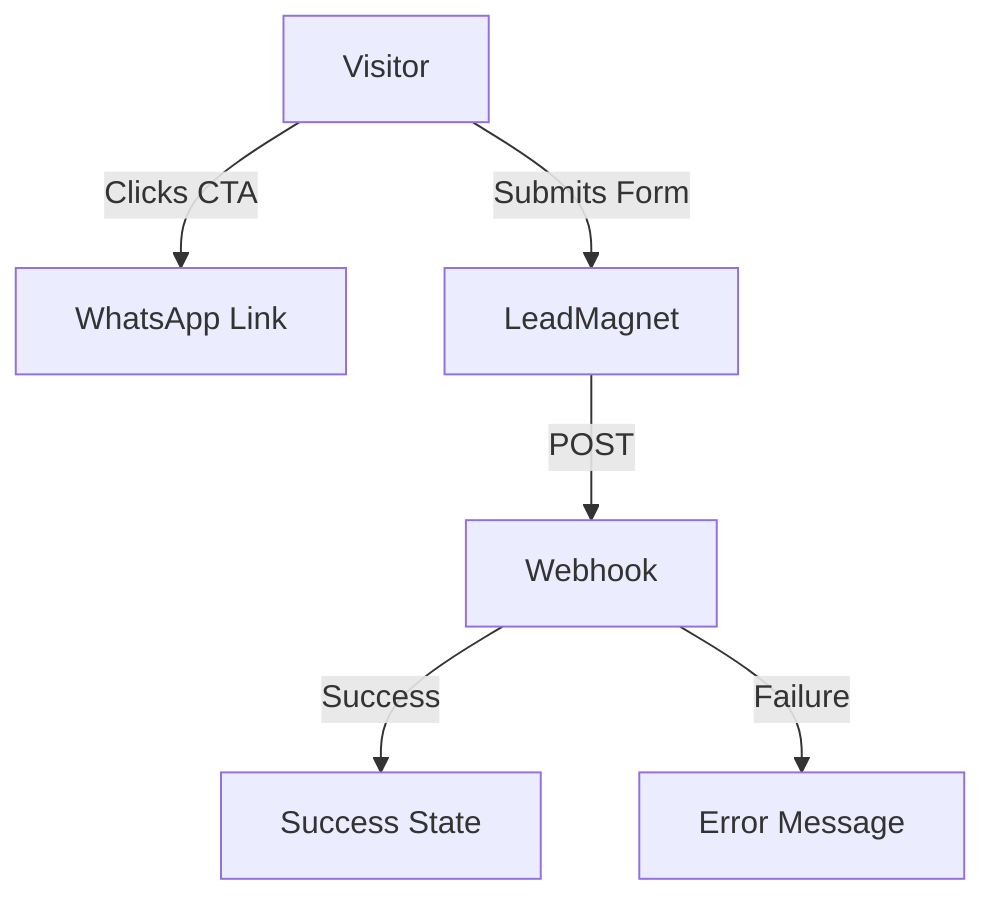

# AGENTS.md
This file provides guidance to Verdent when working with code in this repository.

## Table of Contents
1. Commonly Used Commands
2. High-Level Architecture & Structure
3. Key Rules & Constraints
4. Development Hints
5. Related Documentation

## Commands
- `npm run dev` — Start Vite dev server (port auto-increments if 5173 in use)
- `npm run build` — TypeScript check + Vite production build
- `npm run preview` — Preview production build locally

## Architecture

### Tech Stack
- **Framework:** React 19 + TypeScript 6
- **Build Tool:** Vite 8 with `@vitejs/plugin-react`
- **Styling:** Tailwind CSS v4 (via `@tailwindcss/vite`)
- **Animation:** Framer Motion for scroll-triggered reveals and micro-interactions
- **Forms:** React Hook Form + Zod for validation
- **Headless UI:** Radix UI primitives (Accordion, Dialog, Select, Tooltip)
- **SEO:** `react-helmet-async` with JSON-LD LocalBusiness schema

### Project Structure
```
mottobiz/
├── src/
│   ├── components/          # Page sections (Hero, Services, FAQ, etc.)
│   │   ├── effects.tsx      # CustomCursor + AnimatedBackground
│   │   └── SEOHead.tsx      # Meta tags + schema.org markup
│   ├── lib/
│   │   ├── config.ts        # [CRITICAL] All contact/business constants
│   │   ├── animations.ts    # Framer Motion variants (fadeUp, stagger, etc.)
│   │   └── utils.ts         # cn() helper for Tailwind classes
│   ├── index.css            # Tailwind v4 theme + custom keyframes
│   ├── App.tsx              # Section composition
│   └── main.tsx             # Entry point with HelmetProvider
├── vite.config.ts           # Path alias `@/` → `./src`
└── tsconfig.json            # `ignoreDeprecations: "6.0"` required for baseUrl
```

### Design System [inferred]
- **Palette:** Dark luxury (`#0A0A0F` base, `#5B4EFF` accent, `#F5C842` gold)
- **Typography:** Instrument Serif (display) + DM Sans (body)
- **Effects:** Glassmorphism (`backdrop-filter: blur`), custom cursor (pointer devices only), cursor-reactive gradient background
- **Animation:** Staggered fade-up on scroll, hover glows on CTAs, accordion expand/collapse

### Data Flow
1. Lead form submission → `LEAD_WEBHOOK_URL` (n8n/Make endpoint)
2. WhatsApp CTAs → `WHATSAPP_LINK` (pre-filled message)
3. SEO schema → JSON-LD LocalBusiness with Surat geo coordinates



## Key Rules & Constraints

### Critical: All Contact Info in `src/lib/config.ts`
- **Never** hardcode phone/email/WhatsApp in components
- Always import from `@/lib/config` — single source of truth for:
  - `WHATSAPP_NUMBER`, `WHATSAPP_LINK`, `EMAIL`, `PHONE_DISPLAY`
  - `SITE_URL`, business address, geo coordinates
  - `LEAD_WEBHOOK_URL` (empty = graceful error on form submit)

### Cursor Behavior
- Custom cursor only on `@media (pointer: fine) and (hover: hover)`
- Uses event delegation (`document.addEventListener('mouseover')`) — no per-element listeners
- Falls back to native cursor on touch devices

### Component Patterns
- Sections use `useInView` from Framer Motion for scroll-triggered animations
- Glass cards: combine `.glass` class + hover state transitions
- CTAs: dual pattern — primary (gradient) + secondary (outline)

### TypeScript
- `ignoreDeprecations: "6.0"` is required — do not remove (TypeScript 6 + baseUrl deprecation)
- Path alias `@/` resolves to `./src` — always use for imports

### SEO Requirements
- `HelmetProvider` wraps `<App />` in `main.tsx` — never inside components
- LocalBusiness schema includes Surat-specific geo coordinates
- NAP (Name/Address/Phone) must match exactly across Footer + Schema

## Development Hints

### Adding a New Section
1. Create `src/components/NewSection.tsx`
2. Use `useInView` + `staggerContainer/staggerItem` from `@/lib/animations`
3. Add to `App.tsx` between existing sections
4. Update `Navbar` anchor links if section has in-page nav

### Modifying Contact Info
- Edit **only** `src/lib/config.ts`
- All components auto-update via imports

### Adding Form Fields
- Extend Zod schema in `LeadMagnet.tsx`
- Register with `react-hook-form`'s `register()`
- Error messages use `#ff6060` color

### Styling New Components
- Use CSS variables from `@theme` in `index.css`
- Glass effect: `className="glass"` + `rounded-2xl`
- Text gradient: `className="text-gradient-gold"` or `"text-gradient-accent"`

### Deployment Prep
1. Verify `LEAD_WEBHOOK_URL` is set (or form shows error gracefully)
2. Confirm `SITE_URL` matches production domain
3. Check `dist/` output: `npm run build && npm run preview`

## Related Documentation

| Document | Purpose |
|----------|---------|
| `PRD.md` | Product requirements and feature specifications |
| `TASKS.md` | Task tracking and backlog management |
| `TECHSTACK.md` | Technology stack details and decisions |
| `ROADMAP.md` | Development roadmap and future plans |
| `DESIGN.md` | Design system, colors, typography |
| `ARCHITECTURE.md` | System architecture and data flow |
